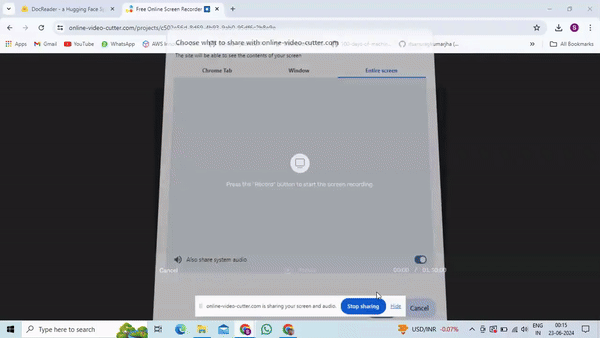

# Invoice-Data-Extraction-Using-Machine-Learning
Develop a Python application to extract key information from invoices using machine learning. The project involves training a model, optimizing it for deployment, and running it on a client desktop. The solution should handle various invoice formats in English, Dutch, and French without hardcoded labels.

# Invoice Data Extraction Using Machine Learning

## Objective

Develop a Python application to extract key information from invoices using machine learning. The project involves training a model, optimizing it for deployment, and running it on a client desktop. The solution handles various invoice formats in English, Dutch, and French without hardcoded labels, understanding the context to accurately extract information.

## Demo


## Project Structure

- `data/`: Contains example invoices and a sample dataset for training and testing.
  - `example_invoices/`: Sample invoices for testing the application.
  - `sample_dataset/`: Training dataset including invoices in English, Dutch, and French.

- `models/`: Directory for storing trained and optimized models.
  - `onnx/`: Optimized models in ONNX format.

- `notebooks/`: Jupyter notebooks for data preprocessing and model training.
  - `data_preprocessing.ipynb`: Notebook for data preprocessing and annotation.
  - `model_training.ipynb`: Notebook for model training and evaluation.

- `src/`: Source code for data preprocessing, model training, optimization, and deployment.
  - `data_preprocessing.py`: Script for data preprocessing and annotation.
  - `model_training.py`: Script for model training.
  - `model_optimization.py`: Script for model optimization.
  - `model_deployment.py`: Script for model deployment.

- `tests/`: Contains unit tests for the model.
  - `test_model.py`: Unit tests for the trained model.

- `.gitignore`: Git ignore file.
- `README.md`: Project documentation.
- `requirements.txt`: List of Python dependencies.
- `app.py`: Main application script for running the Gradio interface.

## Setup and Installation

1. Clone the repository:

```bash
git clone https://github.com/your-username/InvoiceDataExtraction.git
cd InvoiceDataExtraction
